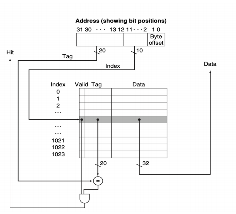

# Assignment 6
Run the program in the `cache simulator` and study how the instruction cache works.
Then give full answers to the following questions.
1. How is the full 32-bit address used in the cache memory?
2. What happens when there is a cache miss?
3. What happens when there is a cache hit?
4. What is the block size?
5. What is the function of the tag?
***
## 1. 32-bit address used in cache memory:
There are 16 bytes in a cache block, the OFFSET field must contain 4 
bits, 10 bits for SET field and 18 bits for TAG field.

|  TAG 18 bits | SET 10 bits  |  OFFSET 4 bits |

- Tag: a unique identifier for a group of data.
- Set: the index in the cache memory.
- Offset: define byte offset from the index(set).

## 2. Cache miss: 
When a cache miss occurs, the system locates new entry and put the data 
from main memory to that location. Then increase the latency, the 
latency is offset by the cache hits on other data.
## 3. Cache hit:
Cache hit means the data occurs in the cache memory, so the processor 
gets the data from the entry from cache.
## 4. Block size:
The number of data in each cache line is called block size and its size is 
power of 2.
## 5. Tag:
Different regions of memory may be mapped into a block, the tag is used 
to differentiate between them.

