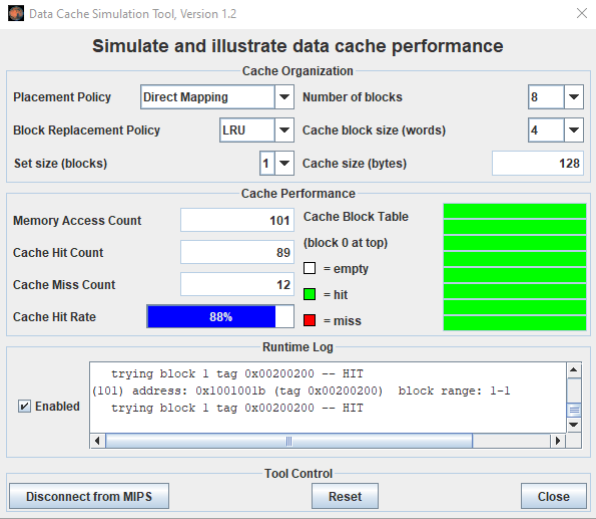
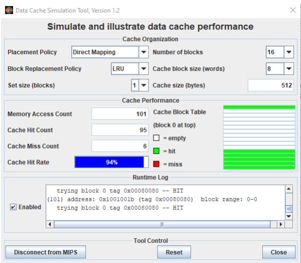
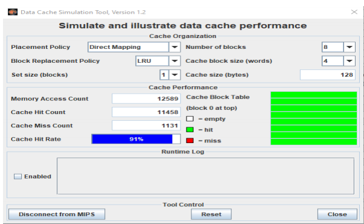
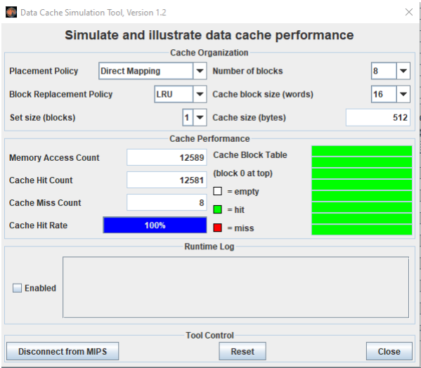

# Assignment 7
The parameters of the cache memory can be changed to test the effects of different cases.
Investigate the effects of different parameter settings.
1.  Explain  the  following:  cache  size,  block  size,  number  of  sets,  write  policy  and replacement policy.
2.  If  a  cache  is  large  enough  that  all  the  code  within  a  loop  fits  in  the  cache,  how  many cache misses will there be during the execution of the loop? Is this good or bad?
3. What should the code look like that would benefit the most from a large block size?
***

## 1. Explain  the  following:  cache  size,  block  size,  number  of  sets,  write  policy  and replacement policy.
* **Cache size, block size larger**
    * Cache size or block size increase that make the miss rate of cache  decrease, because the number of blocks that can be held in the cache will become small, and there will be a great deal of competition for those blocks.

        

    * When increasing the number of blocks and the cache block size, the cache hit rate increase dramatically, the cache miss counter also decreases a lot

* **Number of sets**
    * The more number of sets is the less cache miss the program gets, because the number of sets depend on the number of 
    blocks and cache size.
    * The set containing a memory block is given by (Block number) modulo (Number of sets in cache).

* **Write policy, replacement policy**
    * If we use write through, it will require more main memory writes because each time the data is written to the cache we also write data to main memory.
    * If we use write back (a dirty bit (D) is associated with each cache block. D is 1 when the cache block has been written and 0 otherwise.
    * Dirty cache blocks are written back to main memory only when they are evicted from the cache) it will require less main memory write than write through, then the program gets better cache performance.

* **Replacement policy**
    * LRU policy makes the cache miss counter increase. Less than with the random policy.
    * LRU replacement is implemented by keeping track of when each element in a set was used relative to the other elements in the set.
    * For a two-way set-associative cache, tracking when the two elements were used can be implemented by keeping a single bit in each set and setting the bit to indicate an element whenever that element is referenced. 
    * As associativity increases, implementing LRU gets harder.
***
## 2. If a cache memory is so large that all the code of a loop into the cache memory, how many cache misses will occur during the execution of the loop? Is this good or bad.

When cache memory is so large that all the code of a loop fits into the cache memory, there will be no cache misses. It is good because the program does not have cache miss, then there will be no delay time 
    => increase cache performance.
***
## 3. What should a code (i.e. program) look like to get the most benefit of a large block size?
Large block sizes help to reduce number of total blocks in cache, but it can also increase conflict miss, because more address would map to same set and could get conflict.
To get the most benefit of a large block size, a code should contain arrays, stacks (sequent data structure).
In the Sample Code 2 is an example of taking advantages of large block size.

By default, the Cache Hit rate at 91%, there are more than 1000 times the cache miss happened. However, when increase the cache block size the Cache Hit Rate increase dramatically and also the cache miss nearly does not happen.

